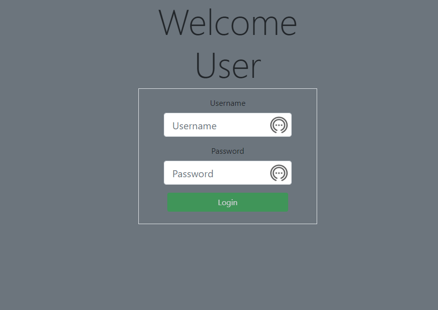
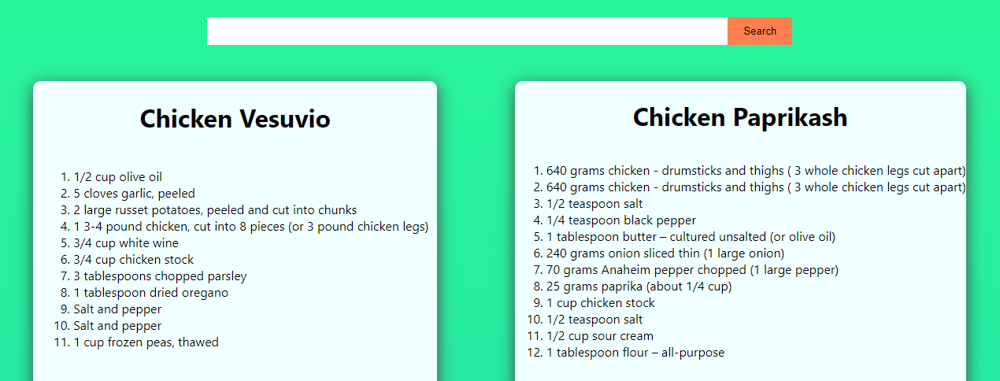
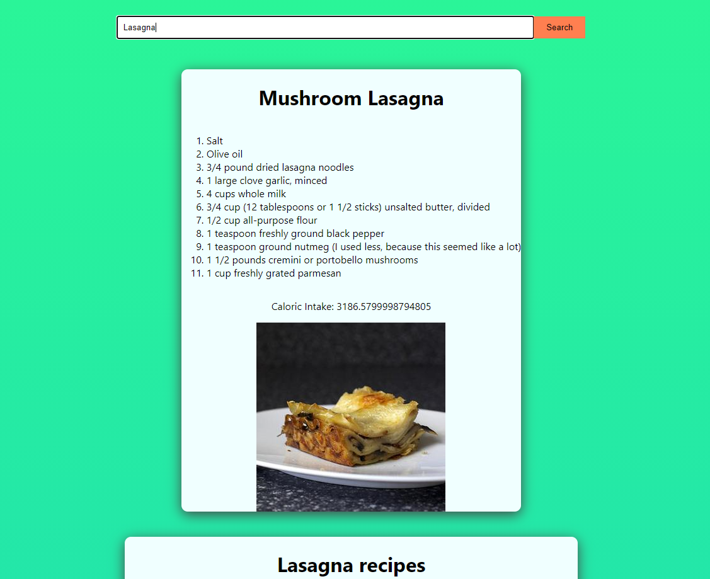
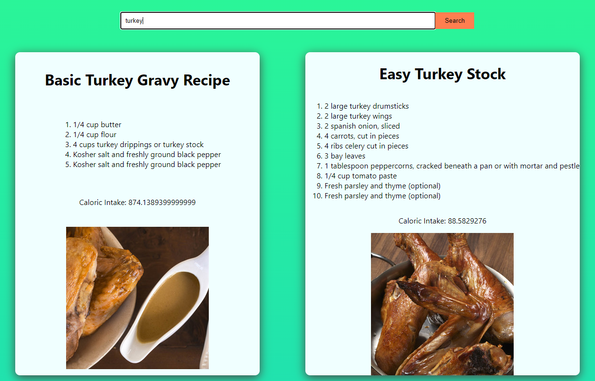

# React Recipe Finder

### Michigan State University Coding Boot Camp

## Table of Contents

* [Description](#Description)
* [Links](#Links)
* [API](#API)
* [How to](#How-to-get-started-with-this-project)
* [use the app](#To-use-the-app)
* [create the app](#To-create-the-app-from-the-files-in-our-team's-GitHub-repository)
* [Requirements](#Project-Requirements)
* [Members](#Project-Members)

## Description

The target audience for this Recipe app is users who want to search for any type of food and recieve multiple different recipe options as a result. As a user you are able to log in and save your recipes that you like so you can find them easy the next time you log in. You are also able to use the app without logging in if that is what you prefer.

## Links

Our React Recipe App is deployed on Heroku.

* [Heroku-deployed app](https://msu-project-3.herokuapp.com/)

* [GitHub repository](https://github.com/stephanie-hall/project-3)

## API

[Recipe API](https://developer.edamam.com/edamam-recipe-api)

## How to get started with this project

### To use the app

Visit the Heroku link above.

The first page you see will be a sign up/sign in page. You will need to create a login and sign in to reach the next page.

Once you are logged in you will be able to see the home page which includes a search bar and a few example recipes.

You are able to search for a specific meal you want a recipe for or you can search an item such as chicken and get a few recipe's that include chicken

### To create the app from the files in our team's GitHub repository

1. On github copy our project repo from the code dropdown and clone into your own file in your terminal.

2. With visual studio code, in the terminal type npm i to install all the necessary dependinces.

3. To run the app type npm start into your terminal within visual studio code.

## Project Requirements

* Must use ReactJS in some way
* Must use a Node and Express Web Server
* Must be backed by a MySQL or MongoDB database with a Sequelize or Mongoose ORM
* Must have both GET and POST routes for retrieving and adding new data
* Must deploy this application using Heroku with data.
* Follow our guide on deploying MERN applications to Heroku to do so
* Must utilize at least 2 libraries, packages, or technologies that we haven't discussed
* Must allow for or involve the authentication of users in some way
* Must have a polished front end/UI
* Must have a folder structure that meets the MVC paradigm
* Must meet good quality coding standards (indentation, scoping, naming)
* Must protect API keys in Node with environment variables

### Project Members

* @WD40JS
* @stephanie-hall
